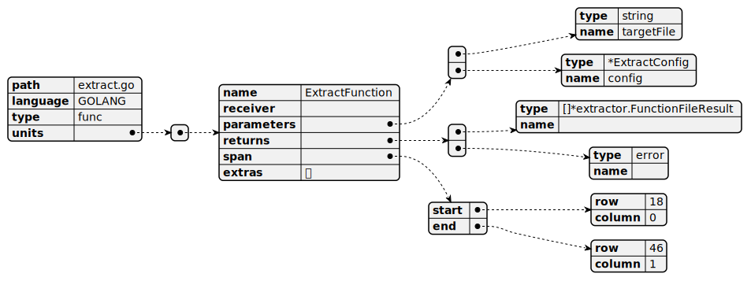

# sibyl 2

> An out-of-box codebase snapshot service, for everyone.

[中文文档](https://opensibyl.github.io/doc/docs/intro)

## Status

| Name           | Badge                                                                                                                                                                 |
|----------------|-----------------------------------------------------------------------------------------------------------------------------------------------------------------------|
| Latest Version |                                                                           |
| Unit Tests     | [](https://github.com/opensibyl/sibyl2/actions/workflows/ci.yml)                         |
| Docker Image   | [](https://github.com/opensibyl/sibyl2/actions/workflows/imagebuild.yml) |
| Perf Tests     | [](https://github.com/opensibyl/sibyl2/actions/workflows/perf.yml)               |
| Code Coverage  | [](https://codecov.io/github/opensibyl/sibyl2)                   |
| Code Style     | [](https://goreportcard.com/report/github.com/opensibyl/sibyl2)                          |

## Overview

sibyl2 is a static code analyze service, for extracting, managing and offering codebase snapshot. Inspired
by [semantic](https://github.com/github/semantic) of GitHub.

- Easy to use
- Fast enough
- Extensible
- Multiple languages in one (Go/Java/Python ...)

## What's `Codebase Snapshot`?


Raw source code:

```go
func ExtractFunction(targetFile string, config *ExtractConfig) ([]*extractor.FunctionFileResult, error) {
// ...
}
```

Code snapshot is the logical metadata of your code:



We can do series of things based on it. Such as logical diff, function relationship analysis.

## Purpose & Principles

See [About This Project: Code Snapshot Layer In DevOps](https://github.com/opensibyl/sibyl2/issues/2) for details.

## Languages support

| Languages  | Function | Function Context | Class |
|------------|----------|------------------|-------|
| Golang     | Yes      | Yes              | Yes   |
| Java       | Yes      | Yes              | Yes   |
| Python     | Yes      | Yes              | Yes   |
| Kotlin     | Yes      | Yes              | Yes   |
| JavaScript | Yes      | Yes              | Yes   |

## Try it in 3 minutes

### Deployment

For now, we are aiming at offering an out-of-box service.
Users can access all the features with a simple binary file, without any extra dependencies and scripts.

You can download from [the release page](https://github.com/opensibyl/sibyl2/releases).

Or directly download with `wget` (linux only):

```bash
curl https://raw.githubusercontent.com/opensibyl/sibyl2/master/scripts/download_latest.sh | bash
```

Now you can start it:

```bash
./sibyl server
```

That's it.
Server will run on port `:9876`.
Data will be persisted in `./sibyl2Storage`.

#### Upload


```bash
./sibyl upload --src . --url http://127.0.0.1:9876
```

You can upload from different machines. Usually it only takes a few seconds.

#### Access

We have a built-in dashboard for visualization. Start it with:

```bash
./sibyl frontend
```

And open `localhost:3000` you will see:


Also, you can access all the datas via different kinds of languages, to build your own tools:

| Language   | Link                                                 |
|------------|------------------------------------------------------|
| Golang     | https://github.com/opensibyl/sibyl-go-client         |
| Java       | https://github.com/opensibyl/sibyl-java-client       |
| JavaScript | https://github.com/opensibyl/sibyl-javascript-client |

See our [examples](./_examples) about how to use for details.

## Performance

We have tested it on some famous repos, like [guava](https://github.com/google/guava). And that's why we can say it is "
fast enough".

See https://github.com/williamfzc/sibyl2/actions/workflows/perf.yml for details.

| Language | Repo                                               | Cost |
|----------|----------------------------------------------------|------|
| Golang   | https://github.com/gin-gonic/gin.git               | ~1s  |
| Java     | https://github.com/spring-projects/spring-boot.git | ~50s |
| Python   | https://github.com/psf/requests                    | ~1s  |
| Kotlin   | https://github.com/square/okhttp                   | ~1s  |

## Contribution

This project split into 3 main parts:

- /cmd: Pure command line tool for general usage
- /pkg/server: All-in-one service for production
- others: Shared api and core

Workflow:

- core: collect files and convert them to `Unit`.
- extract: classify and process units into functions, symbols.
- api: higher level analyze like callgraph

Issues / PRs are welcome!

## References

- basic grammar: https://tree-sitter.github.io/tree-sitter/creating-parsers#the-grammar-dsl
- language parser (for example, golang): https://github.com/tree-sitter/tree-sitter-go/blob/master/src/parser.c
- symbol: https://github.com/github/semantic/blob/main/docs/examples.md#symbols
- stack graphs: https://github.blog/2021-12-09-introducing-stack-graphs/

## License

Apache License Version 2.0, see [LICENSE](LICENSE)
